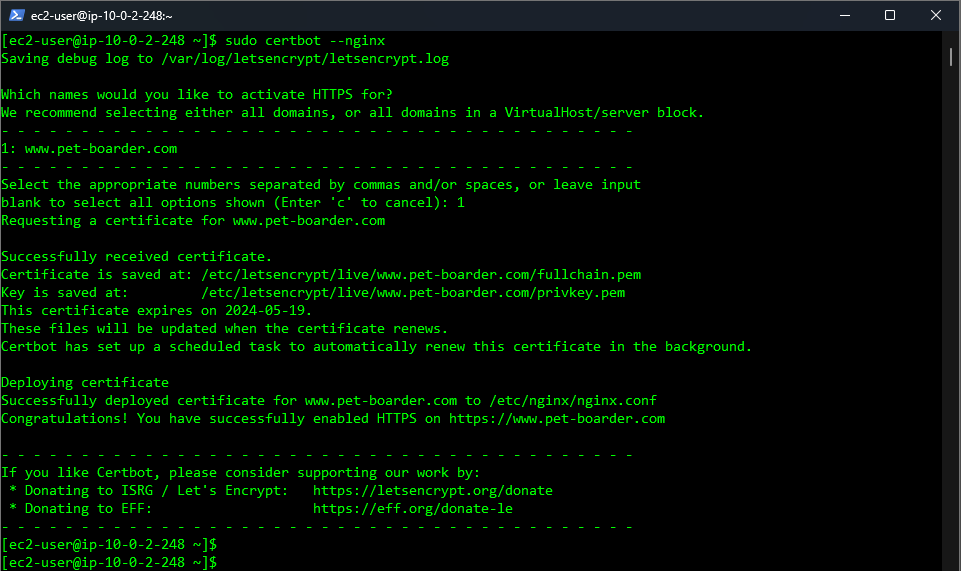

# Swtting Up https reverse proxy for a Node.js application hosted in an AWS EC2 Instance using Nginx:

To install a certificate from Certbot using Nginx on an AWS Linux EC2 instance, follow these general steps, which are applicable across many Linux distributions:

1. Install Certbot and the Nginx Plugin: First, you need to have Certbot and its Nginx plugin installed on your EC2 instance. You can install these with your package manager. For Amazon Linux, which is similar to CentOS/RHEL, you might first need to enable the EPEL repository:

```text
 sudo yum install certbot python3-certbot-nginx
```

2. Run this command to get a certificate and have Certbot edit your nginx configuration automatically to serve it, turning on HTTPS access in a single step.

```text
sudo certbot --nginx
```

Follow the command instructions that will be displayed on the terminal.



3. The Certbot packages on your system come with a cron job or systemd timer that will renew your certificates automatically before they expire. You will not need to run Certbot again, unless you change your configuration. You can test automatic renewal for your certificates by running this command:

```text
sudo certbot renew --dry-run
```

This will be the successful output


The command to renew certbot is installed in one of the following locations:


* `/etc/crontab/`
* `/etc/cron.*/*`
* `systemctl list-timers`

4. You can check the contents of the `/etc/nginx/nginx.conf` that would be recently updated

```text
# For more information on configuration, see:
#   * Official English Documentation: http://nginx.org/en/docs/
#   * Official Russian Documentation: http://nginx.org/ru/docs/

user nginx;
worker_processes auto;
error_log /var/log/nginx/error.log notice;
pid /run/nginx.pid;

# Load dynamic modules. See /usr/share/doc/nginx/README.dynamic.
include /usr/share/nginx/modules/*.conf;

events {
    worker_connections 1024;
}

http {
    log_format  main  '$remote_addr - $remote_user [$time_local] "$request" '
                      '$status $body_bytes_sent "$http_referer" '
                      '"$http_user_agent" "$http_x_forwarded_for"';

    access_log  /var/log/nginx/access.log  main;

    sendfile            on;
    tcp_nopush          on;
    keepalive_timeout   65;
    types_hash_max_size 4096;

    include             /etc/nginx/mime.types;
    default_type        application/octet-stream;

    # Load modular configuration files from the /etc/nginx/conf.d directory.
    # See http://nginx.org/en/docs/ngx_core_module.html#include
    # for more information.
    include /etc/nginx/conf.d/*.conf;

    server {
        server_name  www.pet-boarder.com;
        root         /home/ec2-user/CEN4090L_Capstone_Project/dist;

        # Load configuration files for the default server block.
        include /etc/nginx/default.d/*.conf;

        location / {
                proxy_pass http://localhost:3000; # Assuming your app runs on port 3000
                proxy_http_version 1.1;
                proxy_set_header Upgrade $http_upgrade;
                proxy_set_header Connection 'upgrade';
                proxy_set_header Host $host;
                proxy_cache_bypass $http_upgrade;
        }

        error_page 404 /404.html;
        location = /404.html {
        }

        error_page 500 502 503 504 /50x.html;
        location = /50x.html {
        }

    listen [::]:443 ssl ipv6only=on; # managed by Certbot
    listen 443 ssl; # managed by Certbot
    ssl_certificate /etc/letsencrypt/live/www.pet-boarder.com/fullchain.pem; # managed by Certbot
    ssl_certificate_key /etc/letsencrypt/live/www.pet-boarder.com/privkey.pem; # managed by Certbot
    include /etc/letsencrypt/options-ssl-nginx.conf; # managed by Certbot
    ssl_dhparam /etc/letsencrypt/ssl-dhparams.pem; # managed by Certbot

}

# Settings for a TLS enabled server.
#
#    server {
#        listen       443 ssl http2;
#        listen       [::]:443 ssl http2;
#        server_name  _;
#        root         /usr/share/nginx/html;
#
#        ssl_certificate "/etc/pki/nginx/server.crt";
#        ssl_certificate_key "/etc/pki/nginx/private/server.key";
#        ssl_session_cache shared:SSL:1m;
#        ssl_session_timeout  10m;
#        ssl_ciphers PROFILE=SYSTEM;
#        ssl_prefer_server_ciphers on;
#
#        # Load configuration files for the default server block.
#        include /etc/nginx/default.d/*.conf;
#
#        error_page 404 /404.html;
#        location = /404.html {
#        }
#
#        error_page 500 502 503 504 /50x.html;
#        location = /50x.html {
#        }
#    }


    server {
    if ($host = www.pet-boarder.com) {
        return 301 https://$host$request_uri;
    } # managed by Certbot


        listen       80;
        listen       [::]:80;
        server_name  www.pet-boarder.com;
    return 404; # managed by Certbot
    
    }
}
```

5. This would be the **server block** configuration in the `/etc/nginx/sites-available/pet-boarder.com` file.

```text
server {
    listen 80;

    server_name pet-boarder.com www.pet-boarder.com;
    return 301 https://$host$request_uri;

    /home/ec2-user/CEN4090L_Capstone_Project/dist       # website's root directory
    index index.html;                                   # default index file

    location / {
        proxy_pass http://localhost:3000;               # Assuming your app runs on port 3000
        proxy_http_version 1.1;
        proxy_set_header Upgrade $http_upgrade;
        proxy_set_header Connection 'upgrade';
        proxy_set_header Host $host;
        proxy_cache_bypass $http_upgrade;
    }

    listen [::]:443 ssl ipv6only=on;                                            # managed by Certbot
    listen 443 ssl;                                                             # managed by Certbot
    ssl_certificate /etc/letsencrypt/live/pet-boarder.com/chain.pem;            # managed by Certbot
    ssl_certificate_key /etc/letsencrypt/live/pet-boarder.com/privkey.pem;      # managed by Certbot
    include /etc/letsencrypt/options-ssl-nginx.conf;                            # managed by Certbot
    ssl_dhparam /etc/letsencrypt/ssl-dhparams.pem;                              # managed by Certbot
}
```

6. **Test Nginx Configuration:**

```text
sudo nginx -t
```

If everything is okay, you should see a **message** indicating that the **configuration test** is **successful**.

7. **Restart Nginx:**

* Apply the **configuration changes** by restarting Nginx:

```text
sudo systemctl restart nginx
```

## Resources:

* [Let's Encrypt](https://letsencrypt.org/getting-started/)
* [Certbot Instructions](https://certbot.eff.org/instructions?ws=nginx&os=ubuntufocal)